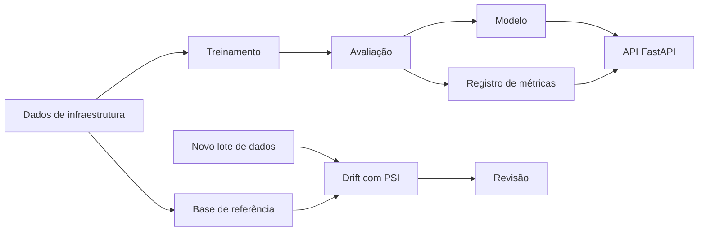

# Arquitetura

O projeto separa treino, inferência e monitoramento de drift para facilitar testes e evolução de cada parte.

## Organização

- `data.py`: geração dos dados usados no laboratório.
- `train.py`: treinamento e comparação dos modelos.
- `model.py`: carregamento do modelo e predição.
- `registry.py`: versão, métricas e hash do artefato.
- `drift.py`: cálculo de PSI por feature.
- `app.py`: API de inferência e consulta.
- `tests/`: testes do pipeline e da API.

Os dados usados aqui são gerados localmente. O PSI serve para mostrar mudança de distribuição e não, sozinho, queda de qualidade do modelo.
