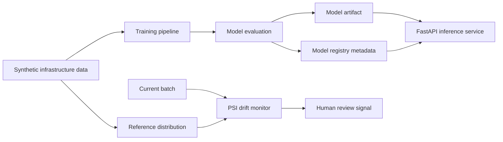

# Architecture

## Goal

This lab demonstrates the lifecycle of an operational ML model from synthetic telemetry generation to inference and drift monitoring.

## Data flow

## Components

- `data.py`: generates reference and shifted telemetry datasets.
- `train.py`: trains, compares and selects candidate models.
- `model.py`: loads the selected artifact and exposes prediction helpers.
- `registry.py`: records model metadata, metrics and artifact integrity.
- `app.py`: exposes inference, model metadata and drift endpoints.
- `drift.py`: calculates Population Stability Index per feature.
- `tests/`: validates API and pipeline behavior.

## Operational boundaries

The dataset is synthetic and the drift detector measures distribution change, not production model degradation. A production system would add authenticated model promotion, telemetry persistence, alerting, rollback and model-performance monitoring.
